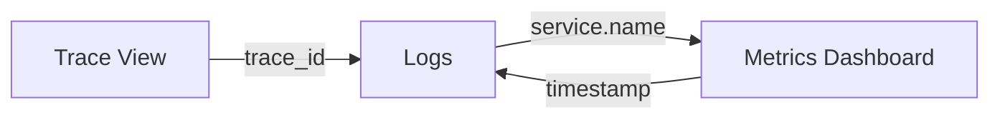

```markdown
# OpenTelemetry (OTel) — interview-ready revision

> Summary: OpenTelemetry fundamentals — SDKs, Collector pipelines, exporters, sampling, and correlating traces/metrics/logs.
>
> How to use: instrument a sample service with an OTel SDK, send data to the Collector, and export to Prometheus/Tempo/Grafana for end-to-end visibility.

1) Core pieces
- SDKs (language-specific), Collector (agent/collector), exporters (Prometheus, OTLP, Jaeger/Tempo), and propagators.

2) Traces vs Metrics vs Logs
- Traces: request flows & spans; Metrics: aggregated numeric series; Logs: unstructured events — correlate via trace_id or service labels.

3) Collector pipeline (example)
- Receivers: otlp
- Processors: batch, resource, memory_limiter
- Exporters: prometheus, tempo, logging

4) Sampling
- Head-based vs tail-based sampling; choose strategy to reduce ingestion costs while preserving fidelity for critical transactions.

5) Instrumentation best practices
- Add meaningful span names, avoid high-cardinality attributes, and capture error/status codes and durations.

6) Interview Q&A
- Q: When use tail-based sampling? A: When you need to sample based on downstream behavior (e.g., only trace requests that result in errors).

7) Sample Collector Config
```yaml
receivers:
  otlp:
    protocols:
      grpc:
        endpoint: 0.0.0.0:4317
      http:
        endpoint: 0.0.0.0:4318

processors:
  batch:
    timeout: 1s
    send_batch_size: 1024
  memory_limiter:
    check_interval: 1s
    limit_mib: 1024

exporters:
  prometheus:
    endpoint: 0.0.0.0:8889
  otlp:
    endpoint: tempo:4317
    tls:
      insecure: true

service:
  pipelines:
    traces:
      receivers: [otlp]
      processors: [memory_limiter, batch]
      exporters: [otlp]
    metrics:
      receivers: [otlp]
      processors: [memory_limiter, batch]
      exporters: [prometheus]
```

8) Instrumentation Example (Go)
```go
import (
    "go.opentelemetry.io/otel"
    "go.opentelemetry.io/otel/sdk/trace"
)

func main() {
    tp := initTracer()
    defer tp.Shutdown(context.Background())
    
    tracer := otel.Tracer("service-name")
    ctx, span := tracer.Start(context.Background(), "operation-name")
    defer span.End()
    
    // Add attributes
    span.SetAttributes(attribute.String("key", "value"))
}
```

9) Dashboard Correlation Example


Key correlation fields:
- trace_id: Link traces to logs
- service.name: Group metrics by service
- timestamp: Align metrics/logs timeline

--

```
